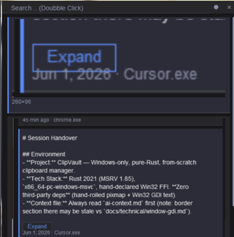

# TrayVault

TrayVault is a clipboard history manager for Windows. It keeps a local history of text, rich text, and images, and lets you search, pin, and paste items back from a small custom UI.

The app runs in the background, opens from a global hotkey or the system tray, and stores everything under your user profile. No cloud sync, no accounts.

<p align="center">
  <a href="assets/screenshot.png">
    
  </a>
</p>
<p align="center"><sub>Click the screenshot to open the full-size image.</sub></p>

Most clipboard tools ship a web view or a pile of frameworks. TrayVault is the opposite: a single native binary in Rust with **zero third-party crates** — only the Rust standard library and the Windows API. Windowing, UI, storage, hashing, and config are implemented in-tree instead of pulling in framework and utility crates.

The codebase is **100% AI-generated** (Rust, docs, and config), built with the same [AI-assisted workflow](https://github.com/OlaProeis/Ferrite/blob/master/docs/ai-workflow/ai-development-workflow.md) used for [Ferrite](https://github.com/OlaProeis/Ferrite). Human work is product direction, testing, and orchestration — not line-by-line coding.

## Download

**Windows 10 or later (64-bit).** Pick the option that fits how you want to install:

| | Download | Best for |
|---|----------|----------|
| **Installer** | [**trayvault-windows-x86_64.msi**](https://github.com/OlaProeis/TrayVault/releases/latest/download/trayvault-windows-x86_64.msi) | Per-user install under `%LOCALAPPDATA%\TrayVault`, optional Start Menu shortcut and autostart |
| **Portable zip** | [**trayvault-windows-x86_64.zip**](https://github.com/OlaProeis/TrayVault/releases/latest/download/trayvault-windows-x86_64.zip) | Unzip anywhere — includes `trayvault.exe`, icon, README, LICENSE, and font notices |
| **Executable only** | [**trayvault.exe**](https://github.com/OlaProeis/TrayVault/releases/latest/download/trayvault.exe) | Single portable binary — copy anywhere and run |

All builds come from tagged [GitHub Releases](https://github.com/OlaProeis/TrayVault/releases/latest). See [CHANGELOG.md](CHANGELOG.md) for version notes.

### After install

- Open history with the global hotkey (**`Alt+V`** by default) or the system tray icon
- Data and settings live in `%LOCALAPPDATA%\TrayVault\`
- Use **`--minimized`** to start in the tray without showing the main window

### MSI setup options

Choose **Custom** during setup to change optional features before installing:

- **Start TrayVault when Windows starts** — registers the Run key so TrayVault launches minimized to the tray at sign-in (same as Settings → *Start with Windows*)
- **Start Menu shortcut** — optional shortcut to launch TrayVault

A typical install includes the app, autostart, and shortcut by default. You can turn autostart off in Custom setup or later in Settings.

## Why TrayVault

- **Zero dependencies** — nothing in `Cargo.toml` beyond the Rust standard library. No transitive crate tree, no npm-style supply chain, no hidden updates from upstream packages. What you build is what you run.
- **Truly native Windows** — window, message loop, clipboard listener, system tray, global hotkey, autostart, and GDI presentation go through direct Win32 FFI (no `windows` crate, no `winit`, no Electron/Tauri).
- **Low memory use** — CPU software rendering (no GPU stack), event-driven background operation (no polling while hidden in the tray), and images written to disk after capture so long sessions do not grow RAM with every screenshot.
- **Small and stable** — one `.exe`, plain files for history and settings, no embedded browser or runtime. Fewer moving parts means fewer surprises after an OS update.
- **Private by design** — everything stays under `%LOCALAPPDATA%\TrayVault\`. No accounts, no sync, no telemetry.

Architecture notes live in [`docs/`](docs/index.md). MIT licensed.

## Tech stack

TrayVault deliberately avoids the usual Rust GUI and utility crates. Each layer below is implemented in this repo rather than added as a dependency:

| Layer | Typical crates avoided | What TrayVault uses instead |
|-------|------------------------|-----------------------------|
| **Platform** | `windows`, `windows-sys`, `winit` | Direct Win32 FFI — window class, message loop, clipboard, tray, hotkey, registry autostart |
| **Rendering** | `tiny-skia`, `skia`, GPU backends | In-tree RGBA pixmap rasterizer + GDI `StretchDIBits` present path |
| **Text** | `fontdue`, `cosmic-text`, native controls | Win32 GDI glyph rasterization (bundled Roboto via `AddFontMemResourceEx`) |
| **UI** | `egui`, `iced`, web views | Immediate-mode widgets and views — search bar, history list, settings, preview modal |
| **Storage** | `sqlite`, `sled`, ORMs | Line-oriented `entries.dat` + content-addressed image blobs on a background worker thread |
| **Crypto / dedup** | `sha2`, `ring` | In-tree SHA-256 and content hashing |
| **Config / logging** | `toml`, `serde`, `tracing`, `log` | Custom `config.toml` parser and rotating file logger |

**Language & target:** Rust 2021, MSRV 1.85, `x86_64-pc-windows-msvc` only (Windows 10+).

**Development:** Spec in [`docs/trayvault-prd.md`](docs/trayvault-prd.md), tasks via Task Master, implementation through Cursor + MCP. Process details: [AI-assisted development workflow (Ferrite)](https://github.com/OlaProeis/Ferrite/blob/master/docs/ai-workflow/ai-development-workflow.md).

## Features

### Clipboard history
- Automatic capture of text, rich text, and images while TrayVault is running
- Searchable history with filter chips (all, text, images, pinned); typing in search filters text only — images stay visible until you type
- Pin entries so they are kept when the history cap is reached
- Copy items back to the clipboard — single click, double-click, or right-click menu
- Optional deduplication and configurable history size
- Pause capture without quitting

### Search & navigation
- Click-to-focus search bar with caret, text selection, and keyboard editing (arrows, Home/End, Delete, Ctrl+A)
- Real-time text search (case-insensitive); image entries are hidden while the search field has any text — use the **Images** chip with an empty query to browse screenshots
- Delete in the search field removes query text; it does not delete the selected history entry
- Arrow keys move the list selection; sticky search header while scrolling

### Images
- Bilinear-filtered thumbnails in the history list (smooth downscale from full-resolution captures)
- Double-click an image entry for a full-screen preview modal (Esc to close)
- Configurable maximum capture size for large clipboard images

### Window & appearance
- Compact borderless window — drag from the title bar or search area
- Light, dark, or follow-system theme
- Relative timestamps (“just now”, “5 min ago”) on entries
- Remembers window size and position across sessions
- Optional taskbar button while the window is open

### Background operation
- Runs from the system tray with show/hide and quit
- Global hotkey (default `Alt+V`, configurable in settings)
- Optional start with Windows
- Low overhead while hidden — no unnecessary background work in the tray

### Privacy & local storage
- Everything stays on your machine — no cloud, no accounts
- Data directory: `%LOCALAPPDATA%\TrayVault\` (history, image blobs, settings, log)
- Durable history saves and safe cleanup when duplicate images share storage
- Size-capped rotating log file for diagnostics

### Built for responsiveness
- Smooth scrolling and hover feedback even with hundreds of entries and an active search
- Image thumbnails and previews load from cache instead of re-reading disk every frame; downscale uses bilinear filtering (same output size as before, smoother edges)
- Images move to disk after capture so memory stays bounded during long sessions

## Build from source

Requires [Rust](https://www.rust-lang.org/) 1.85 or newer with the `x86_64-pc-windows-msvc` target. TrayVault does not support macOS or Linux.

From the repository root:

```powershell
cargo build --release
```

The release binary is `target\release\trayvault.exe`.

For development checks:

```powershell
cargo build
cargo test
cargo clippy --all-targets -- -D warnings
cargo fmt --check
```

## Run

```powershell
cargo run
```

Or run the release binary directly. Use `--minimized` to start without showing the main window (tray only).

Settings live in `%LOCALAPPDATA%\TrayVault\config.toml`. History and image blobs are stored in the same folder. The app remembers the main window’s size and position across restarts (saved automatically when you move, resize, or quit).

## Documentation

- [Documentation index](docs/index.md)
- [Product requirements](docs/trayvault-prd.md) (draft spec)
- [AI-assisted development workflow](https://github.com/OlaProeis/Ferrite/blob/master/docs/ai-workflow/ai-development-workflow.md) (Ferrite — same process used here)

## License

TrayVault is [MIT licensed](LICENSE).

The bundled UI font **Roboto Regular** (`assets/Roboto-Regular.ttf`) is copyright The Roboto Project Authors and licensed under the **Apache License 2.0**. See [NOTICES.md](NOTICES.md) and [assets/Roboto-LICENSE.txt](assets/Roboto-LICENSE.txt).
